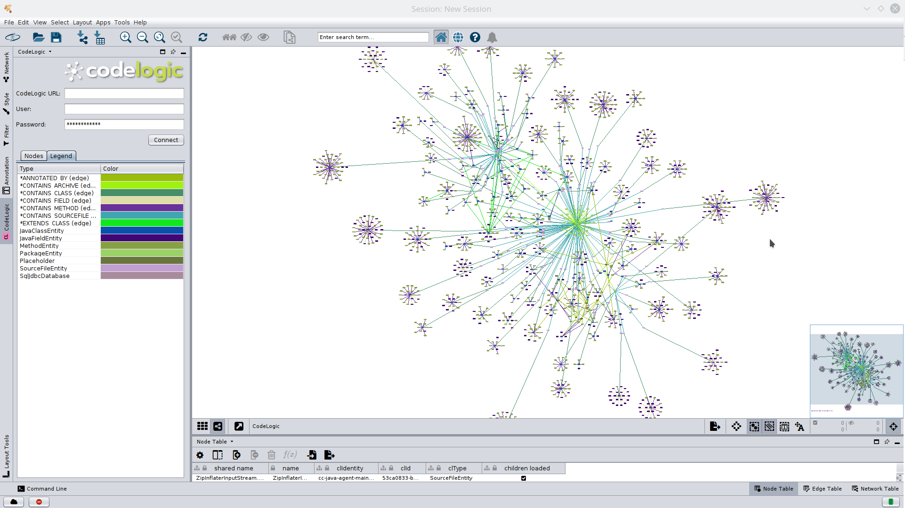

# CodeLogic #

## Reveal the interconnectivity of your application environment in minutes ##

CodeLogic provides a comprehensive view of application dependencies and their relationships in real time, in minutes —giving developers the freedom and agility to leverage innovative technologies, migrations, and changes with a clear path forward.

From method and column, to platform, database, and API, CodeLogic is a single source of truth for dependencies. All in one place, accessible to people and systems anywhere.

